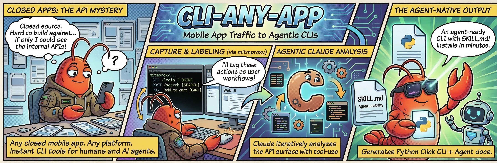

<p align="center">
  
</p>

# cli-any-app

**Transform mobile app network traffic into agent-usable CLI tools.**

cli-any-app captures API calls via mitmproxy while you drive a mobile app on your phone, lets you label the flows through a web UI, then uses Claude to analyze the API surface and generate an installable Python Click CLI with a SKILL.md for LLM consumption.

Built by [Niel Malan](https://github.com/ncmalan).

---

## Why cli-any-app?

Most mobile apps are closed-source — you can't read their code to understand their API. But you *can* observe what they do on the network. cli-any-app turns that observation into a usable CLI tool that both humans and AI agents can operate.

- **Reverse-engineer any mobile app's API** without source code access
- **Label user actions** (login, search, add to cart) as you use the app, so the generated CLI maps to real workflows
- **AI-powered analysis** — Claude examines the captured traffic incrementally using tool-use, so even apps with heavy API traffic won't overflow context limits
- **Agent-ready output** — every generated CLI includes a SKILL.md that LLMs can read to understand and use the tool
- **Works with iOS and Android** — any device that can route through an HTTP proxy

## How It Works

```
┌─────────────┐     mitmproxy      ┌──────────────┐     Claude AI      ┌─────────────┐
│  Mobile App  │ ──── traffic ────▶ │   Web UI     │ ──── analyze ────▶ │  Click CLI  │
│  (on phone)  │                    │  (label &    │                    │  + SKILL.md │
│              │                    │   review)    │                    │             │
└─────────────┘                    └──────────────┘                    └─────────────┘
```

1. **Capture** — mitmproxy intercepts HTTPS traffic from your phone as a man-in-the-middle proxy
2. **Label** — You tag actions in the web UI ("login", "search", "checkout") while using the app
3. **Filter** — Noise domains (analytics, ads, CDNs) are auto-detected and can be excluded
4. **Analyze** — Claude explores the captured traffic iteratively via tool-use to build an API specification
5. **Generate** — Claude produces a complete Python Click CLI package with commands matching the flows you labeled
6. **Validate** — The generated code is syntax-checked and the package structure verified

## Quick Start

### Prerequisites

- Python 3.11+
- Node.js 18+
- mitmproxy

**macOS:**
```bash
brew install python@3.11  # or newer
brew install node
brew install mitmproxy
```

**Ubuntu/Debian:**
```bash
sudo apt install python3.11 python3.11-venv nodejs npm
pip3 install mitmproxy
```

> **Note (macOS):** Install mitmproxy via brew, not pip. mitmproxy is a system tool (like curl or git) — installing it via brew keeps its large dependency tree separate from your project's virtual environment and ensures `mitmdump` is available on your PATH.

### Setup

```bash
git clone https://github.com/ncmalan/cli-any-app.git
cd cli-any-app

# Create and activate virtual environment
python3 -m venv .venv
source .venv/bin/activate

# Install dependencies
pip install -e ".[dev]"

# Set your Anthropic API key (or create a .env file — see Configuration)
export CLI_ANY_APP_ANTHROPIC_API_KEY=your-key-here

# Build the frontend
cd frontend
npm install
npm run build
cd ..

# Start the server
cli-any-app
```

The web UI is available at http://localhost:8000.

## Usage

1. Open the web UI at http://localhost:8000
2. Click **Device Setup** for instructions on configuring your phone's proxy and installing the mitmproxy CA certificate (iOS and Android instructions provided)
3. Create a new session — name it and specify the app name
4. Click **Start Recording**, then open the target app on your phone
5. Use **Start Flow** / **Stop Flow** to label actions as you navigate the app (e.g., "login", "search", "add to cart")
6. Use the domain filter to exclude irrelevant traffic (analytics, ads, etc.)
7. Stop recording when done, then review the captured flows
8. Enter your Anthropic API key if not already configured, and click **Generate CLI**
9. Watch the live progress log as Claude analyzes traffic and generates code

The generated CLI package will be in `data/generated/<app-name>_<session-name>/` and can be installed with:

```bash
pip install -e ./data/generated/<app-name>_<session-name>/
```

### Using the Generated CLI

Each generated CLI includes:

- **Command groups** matching the flows you labeled (e.g., `auth`, `cart`, `search`)
- **JSON output** by default, with `--format table` for human-readable output
- **Auth handling** — automatic token storage and refresh if detected
- **A SKILL.md** — documentation for AI agents explaining how to use the CLI

```bash
# Example: using a generated CLI for a food delivery app
myapp auth login --email user@example.com --password ****
myapp catalog search --query "milk"
myapp cart add --item-id 12345 --quantity 1
myapp orders list
```

## Architecture

Three-layer service orchestrated by FastAPI:

```
cli_any_app/
├── capture/          # mitmproxy addon + proxy manager
│   ├── addon.py      # Runs inside mitmdump, POSTs traffic to FastAPI
│   ├── proxy_manager.py  # Starts/stops mitmdump subprocess
│   ├── filters.py    # API vs non-API classification
│   └── noise_domains.py  # Known noise domain patterns
├── api/              # FastAPI REST + WebSocket endpoints
│   ├── sessions.py   # CRUD + start/stop recording
│   ├── flows.py      # Flow labeling within sessions
│   ├── capture.py    # Receives traffic from mitmproxy addon
│   ├── domains.py    # Domain filtering
│   ├── generate.py   # Generation pipeline trigger
│   ├── settings.py   # Runtime API key configuration
│   └── websocket.py  # Live traffic + generation progress streaming
├── generation/       # AI-powered CLI generation pipeline
│   ├── normalizer.py # Cleans and structures raw traffic
│   ├── redactor.py   # Strips PII/secrets before sending to Claude
│   ├── analyzer.py   # Agentic tool-use loop for API analysis
│   ├── generator.py  # Claude generates Click CLI + SKILL.md
│   ├── validator.py  # Syntax and structure validation
│   ├── pipeline.py   # Orchestrates the full pipeline
│   └── templates/    # Jinja2 templates for boilerplate
├── models/           # SQLAlchemy async models
└── main.py           # FastAPI app + lifespan

frontend/             # React 18 + TypeScript + Vite + Tailwind CSS
├── src/
│   ├── pages/        # Dashboard, SessionSetup, Recording, Review, Generation
│   ├── components/   # StatusBadge, MethodBadge
│   └── lib/api.ts    # API client
```

**Key design decisions:**

- **Agentic analysis** — The analyzer gives Claude tools to browse traffic incrementally (`list_flows`, `get_flow_requests`, `get_request_detail`, `submit_api_spec`) instead of dumping everything into one prompt. This handles apps with heavy traffic without hitting token limits.
- **mitmproxy via subprocess** — mitmdump runs as a child process with a custom addon, keeping the proxy's dependency tree separate from the app.
- **WebSocket streaming** — Both live traffic capture and generation progress are streamed to the UI in real-time.
- **PII redaction** — Sensitive headers (Authorization, cookies) and body fields (passwords, tokens) are redacted before sending traffic to Claude.

## Configuration

All settings can be overridden via environment variables with the `CLI_ANY_APP_` prefix, or in a `.env` file in the project root:

| Variable | Default | Description |
|----------|---------|-------------|
| `CLI_ANY_APP_HOST` | `0.0.0.0` | Server bind address |
| `CLI_ANY_APP_PORT` | `8000` | Server port |
| `CLI_ANY_APP_PROXY_PORT` | `8080` | mitmproxy listen port |
| `CLI_ANY_APP_DEBUG` | `false` | Enable debug mode with auto-reload |
| `CLI_ANY_APP_ANTHROPIC_API_KEY` | *(required for generation)* | Anthropic API key for Claude |

Example `.env` file:
```
CLI_ANY_APP_ANTHROPIC_API_KEY=sk-ant-...
```

The API key can also be set at runtime through the web UI on the session review page.

## Testing

```bash
source .venv/bin/activate
pytest tests/ -v
```

Tests use in-memory SQLite and mock the Claude API. No external services needed.

### Frontend Development

For hot-reloading during frontend development, run the Vite dev server alongside the backend:

```bash
# Terminal 1: backend
source .venv/bin/activate
cli-any-app

# Terminal 2: frontend dev server
cd frontend
npm run dev  # starts on :5173, proxies /api and /ws to :8000
```

## Roadmap

- [ ] **Export/import sessions** — share captured sessions between machines
- [ ] **Multiple generation attempts** — compare different CLI outputs for the same session
- [ ] **Regenerate individual commands** — refine specific command groups without re-running the full pipeline
- [ ] **Authentication flow wizard** — guided setup for apps requiring login before capture
- [ ] **Request/response diff view** — compare similar requests across flows to identify parameters
- [ ] **OpenAPI spec export** — export the analyzed API as an OpenAPI/Swagger spec
- [ ] **Plugin system for output formats** — generate CLIs in languages other than Python
- [ ] **Batch flow labeling** — label multiple requests at once by domain or URL pattern
- [ ] **Session templates** — pre-configured domain filters and flow labels for common app categories
- [ ] **CI/CD integration** — run generation headlessly from captured session files
- [ ] **Rate limit detection** — identify and document rate limits observed in traffic

## Contributing

Contributions are welcome! Please:

1. Fork the repository
2. Create a feature branch (`git checkout -b feature/my-feature`)
3. Make your changes with tests
4. Run `pytest tests/ -v` and `cd frontend && npm run build` to verify
5. Submit a pull request

## License

MIT
